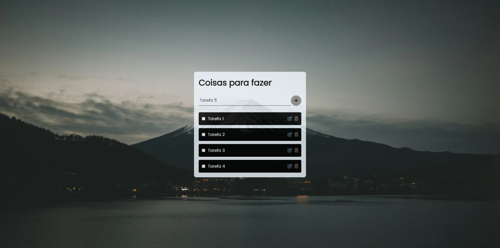

# To-do List

Este é um projeto de To-Do List desenvolvido para praticar a utilização do PDO ( PHP Data Object). O projeto foi desenvolvido seguindo o tutorial da Larissa Kich, disponível em seu canal [Larissa Kich](https://www.youtube.com/@larissakich).

## Tecnologias Utilizadas

- **PHP**
- **MySQL**
- **JQuery**
- **HTML e CSS**

## Funcionalidades

O projeto permiti as seguinte ações:

- **Criar** novas tarefas à lista.
- **Ler** as tarefas salvas.
- **Atualizar** as tarefas existentes.
- **Deletar** as tarefas da lista.

## Requisitos

Para rodar este projeto, é necessário ter um servidor web com suporte a PHP e MySQL.
